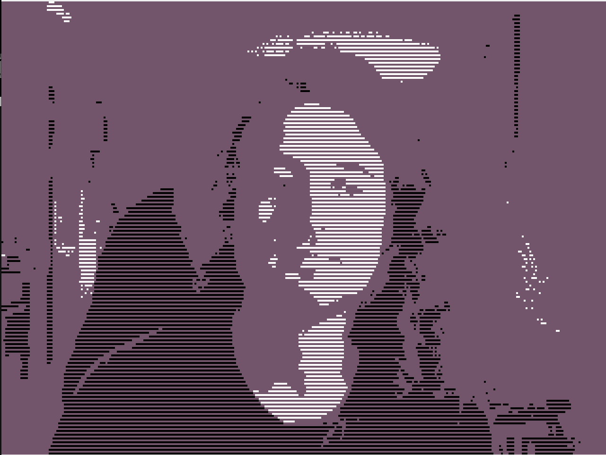
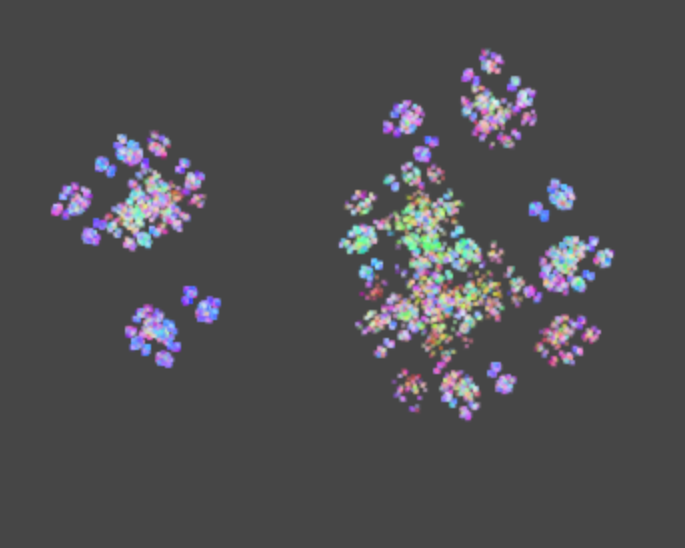

# Genuary 2025

## Day 1 - Horisontal lines only
Realtime opencv image processing to make a linearly dithered webcam view.

## Day 2 - Layers
On the second day of Genuary we celebrate the most layered vegetable of them all, the humble onion, with a procedural multitude of onion varities, claim yours [here](https://demborg.se/genuary25/onion)

## Day 3 - 42 lines of code
An animated iterated function system written in 42 lines of javascript
Try it out [here](https://demborg.se/genuary25/answer)

